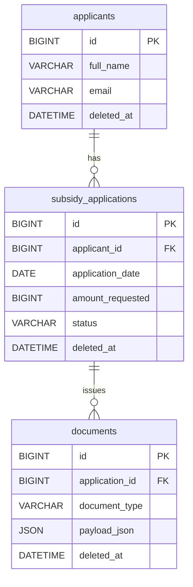

# subsidy-management-api

自治体業務を想定した「補助金申請の管理システム」風の Web API（ポートフォリオ）です。  
申請データの検索・集計（議会報告）をスムーズにし、通知書の作成業務（転記入力）を **Draft（自動入力）＋不足分だけ上書き** で簡略化することを目的にしています。

---

## 目的（What this API solves）
- **申請データの検索・一覧**を素早く行い、申請件数や申請額などの報告を簡単にする
- **通知書発行（交付決定通知／確定通知／調査依頼など）** の転記入力を減らす
    - Draft（下書き自動生成）→ Issue（不足分だけ入力して発行保存）

---

## 技術スタック
- Java 21
- Spring Boot
- MyBatis
- MySQL 8.x（Local: Docker / 将来: RDS想定）
- Flyway（DBマイグレーション）
- Gradle
- Testing: JUnit5 / Spring Boot Test
- GitHub Actions（CI）

---

## Local development（MySQL via Docker）

### 1. MySQL 起動
```powershell
Copy-Item .env.example .env
docker compose up -d
docker compose ps
```

## Local development (MySQL via Docker)

### 1. Start MySQL
```powershell
Copy-Item .env.example .env
docker compose up -d
docker compose ps
```

### 2. Load env vars (PowerShell)
```powershell
Get-Content .env | ForEach-Object {
  if ($_ -match '^\s*$' -or $_ -match '^\s*#') { return }
  $k, $v = $_ -split '=', 2
  [Environment]::SetEnvironmentVariable($k.Trim(), $v.Trim(), "Process")
}
```

### 3. Run with local profile
```powershell
.\gradlew bootRun --args="--spring.profiles.active=local"
```

### 4. Health check
GET `http://localhost:8080/actuator/health`

→ `{"status":"UP"}`
---

# API List (Postman examples)

## 1) Create application
`POST /subsidy-applications`（201 / 400）

**例：**
```json
{
  "applicant": {
    "fullName": "佐藤花子",
    "email": "hanako@example.com"
  },
  "application": {
    "applicationDate": "2026-01-05",
    "amountRequested": 150000,
    "status": "APPLIED"
  }
}
```
## 2) List/Search applications（検索 + ページング + ソート）

`GET /subsidy-applications`

### 代表的な検索条件（整理）
- `q`：氏名（部分一致）
- `status`：状態（例: `APPLIED`）
- `from` / `to`：申請日範囲（`YYYY-MM-DD`）
- `limit` / `offset`：ページング
- `sort`：例 `applicationDate,desc` / `createdAt,asc`

### 例
- 全件（※パラメータ未指定＝全件）
    - `GET /subsidy-applications`
- 状態
    - `GET /subsidy-applications?status=APPLIED`
- 期間
    - `GET /subsidy-applications?from=2026-01-01&to=2026-01-31`
- 氏名
    - `GET /subsidy-applications?q=佐藤`
- ページング + ソート
    - `GET /subsidy-applications?limit=20&offset=0&sort=applicationDate,desc`

> ORDER BY は SQL インジェクション対策として Service 側でホワイトリスト変換し、Mapper には固定文字列のみ渡します。

## 3) Application detail
`GET /subsidy-applications/{id}`（200 / 404）

---

## 4) Logical delete
`DELETE /subsidy-applications/{id}`（204 / 404）  
※物理削除ではなく `deleted_at` を更新する論理削除です。

---

## 5) Reports (summary)
`GET /reports/summary`（条件未指定＝全件を集計）

- `GET /reports/summary`
- `GET /reports/summary?status=APPLIED`
- `GET /reports/summary?status=APPLIED&from=2026-01-01&to=2026-01-31`

---

## 6) Documents (issuance log / draft payload)
- `POST /documents`（201 / 400）
- `GET /documents/draft?applicationId=1&documentType=DECISION_NOTICE`

---

## ER Diagram (simple)

---

## Index rationale (short)

検索条件（status / 期間 / applicant_id / 論理削除）に合わせてインデックスを設計しています。

- `subsidy_applications(applicant_id)`：JOIN
- `subsidy_applications(status)`：状態フィルタ
- `subsidy_applications(application_date)`：期間
- `deleted_at`：論理削除除外

氏名検索（`LIKE '%q%'`）は BTree インデックスが効きづらいため、将来 FULLTEXT 等の改善余地があります。

---

## Branch strategy / PR / CI

- `main` を基準に `feat/*`, `fix/*`, `chore/*`, `docs/*` ブランチで作業
- PR を作成し、CI（GitHub Actions）green を確認して `main` にマージ
- CI は `./gradlew clean test` を実行

---

## Architecture (short)

- Controller：HTTP / DTO / Validation
- Service：業務ロジック、トランザクション境界
- Mapper：SQL 境界（MyBatis）
- Exception：`@RestControllerAdvice` で HTTP エラーへ統一変換
- Delete：論理削除（`deleted_at`）
