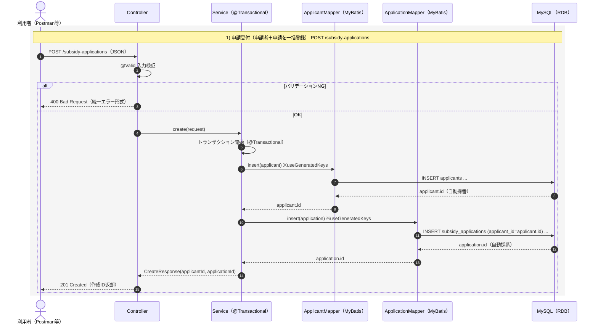
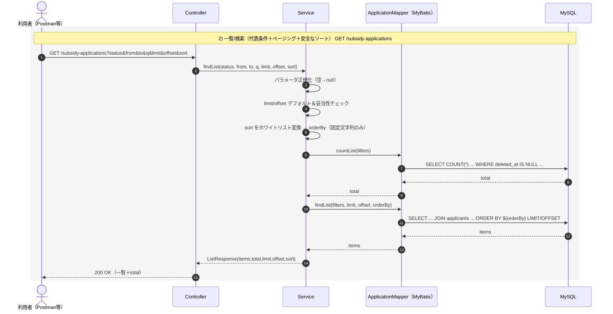
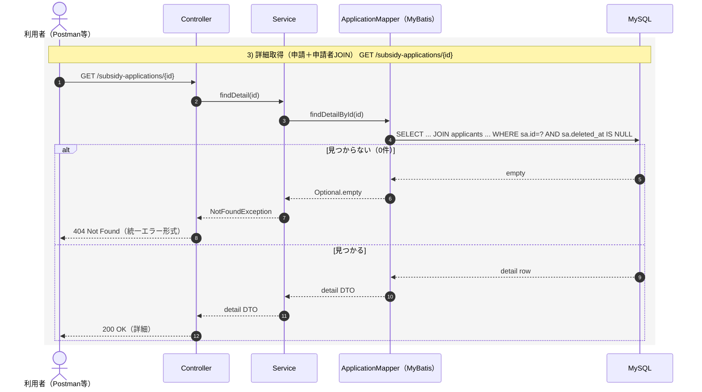
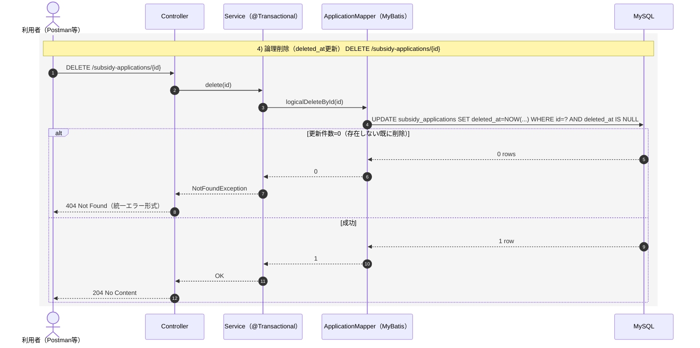
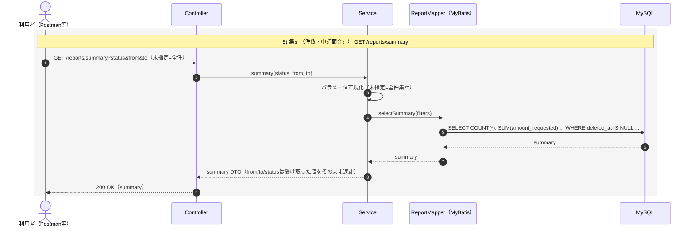
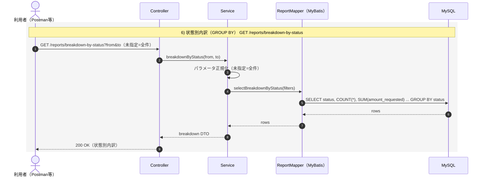
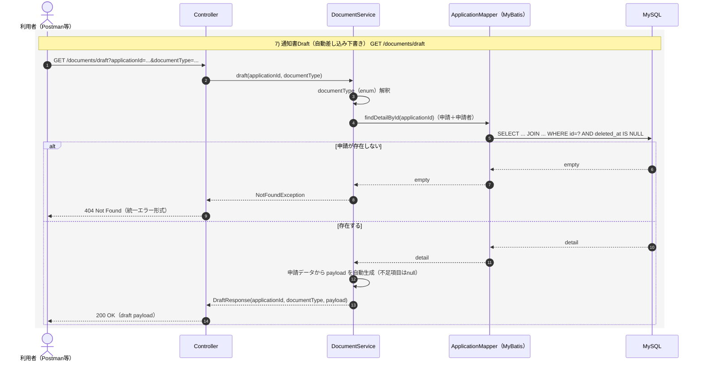
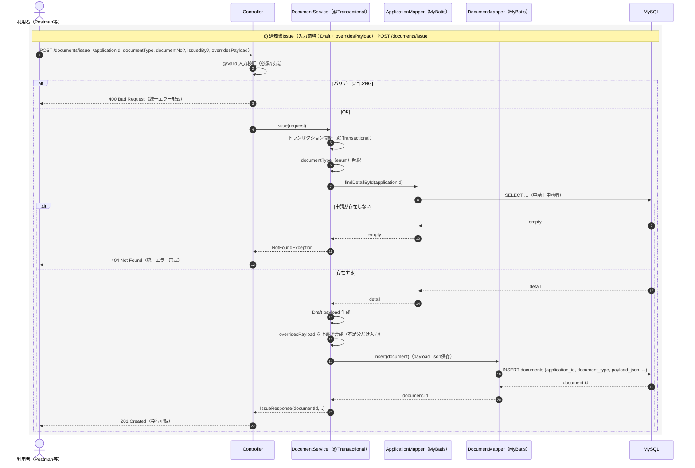

# subsidy-management-api

自治体業務を想定した「補助金申請の管理システム」風の Web API（ポートフォリオ）です。  
申請データの検索・集計（議会報告）をスムーズにし、通知書の作成業務（転記入力）を **Draft（自動入力）＋不足分だけ上書き** で簡略化することを目的にしています。

---

## 🏁 はじめに
本アプリケーションは、Java / Spring Boot / MyBatis を中心に **DB設計・論理削除・例外統一・CI** を意識して作成したポートフォリオです。

---

## 🧾 サービス概要
- **申請データの検索・一覧**を素早く行い、申請件数や申請額などの報告を簡単にする  
- **通知書発行（交付決定通知／確定通知／調査依頼など）** の転記入力を減らす  
  - Draft（下書き自動生成）→ Issue（不足分だけ入力して発行保存）

---

## 💻 開発環境（使用技術・ツール）

### 使用技術

#### バックエンド

#### データベース

### 使用ツール

---

## 📘 機能一覧
| 機能 | 詳細 | メソッド | URL |
|---|---|---:|---|
| 申請受付 | 申請者＋申請を1回のPOSTで登録する | POST | `/subsidy-applications` |
| 申請一覧／検索 | 氏名・状態・期間で検索し、ページング/ソートして返す | GET | `/subsidy-applications` |
| 申請詳細 | 指定したIDの申請詳細（申請者情報含む）を取得する | GET | `/subsidy-applications/{id}` |
| 論理削除 | 指定した申請を論理削除（deleted_at更新）する | DELETE | `/subsidy-applications/{id}` |
| レポート集計 | 件数・申請額合計を集計する（条件未指定＝全件） | GET | `/reports/summary` |
| 状態別内訳 | 状態別（GROUP BY）に件数・合計を返す | GET | `/reports/breakdown-by-status` |
| 通知書Draft | DBから差し込み項目を自動生成して下書きを返す | GET | `/documents/draft` |
| 通知書発行記録 | payloadを保存して通知書発行ログを残す | POST | `/documents` |

---

## 🎥 API動作デモ（画像）

### 🆕 申請受付（POST /subsidy-applications）
- **説明**：申請者＋申請を1回のPOSTで登録し、`201 Created` を確認します。

### 📄 申請一覧／検索（GET /subsidy-applications）
* **説明**：氏名/状態/期間で検索し、ページング/ソートが効くことを確認します。
- 申請一覧（全件）

- 氏名検索（部分一致）

### 🔍 申請詳細（GET /subsidy-applications/{id}）
* **説明**：指定IDの申請詳細が取得できることを確認します。

### 🗑️ 論理削除（DELETE /subsidy-applications/{id}）
* **説明**：`204 No Content` を確認し、その後一覧から消える（deleted_atが入る）ことを確認します。

### 📊 レポート集計（GET /reports/summary）
* **説明**：条件未指定＝全件、条件指定（status/期間）で集計が変わることを確認します。

- 条件未指定＝全件

- 条件指定（status/期間）

### 🧾 状態別内訳（GET /reports/breakdown-by-status）
* **説明**：状態別（GROUP BY）の件数・合計が返ることを確認します。

### 📝 通知書Draft（GET /documents/draft）
* **説明**：`GET /subsidy-applications` で実在する `applicationId` を確認し、そのIDで `GET /documents/draft?applicationId=○○&documentType=DECISION_NOTICE` を叩いてレスポンスの差し込み項目が DBにある値は入っていて、未入力項目は null のまま になっているか確認します。

### 🧾 通知書発行記録（POST /documents）
* **説明**：Draftを元に不足分だけ入力して `201 Created` を確認し、発行ログが残ることを確認します。

---

## 🗂 データベース設計（ER図）

### テーブル概要

| テーブル名                  | 説明                     |
| ---------------------- | ---------------------- |
| `applicants`           | 申請者情報を管理               |
| `subsidy_applications` | 補助金申請情報を管理（申請者に紐づく）    |
| `documents`            | 通知書の発行記録（payload含む）を管理 |

---
## シーケンス図

了解です。いまの実装（申請受付・一覧検索（ページング/ソート）・詳細・論理削除・集計（summary / status別内訳）・documents（draft / issue）・例外統一）前提で、**READMEにそのままコピペできる Mermaid のシーケンス図**を作りました。
（説明は全部日本語、`sequenceDiagram` なので GitHub でそのままレンダリングできます）

---

---

---

---

---

---

---

---

---

## 🧪 テスト（JUnit）

本プロジェクトでは JUnit 5 を用いてテストを実装し、Pull Request 作成時や main ブランチへの push 時に GitHub Actions で自動実行し、品質を担保しています。

了解です。README上で **「⇒ファイル名」** を表示し、そのファイル名自体を **GitHubリンク** にします。
あなたのURLをその形式に置き換えると、こう書けばOKです。

### Controller層（MockMvc）

* **正常系**：期待通りのレスポンス（201/200/204）を返すか
* **異常系**：入力値不正（400）やデータ未存在（404）で、適切な HTTP ステータス・エラーメッセージを返すか

⇒[`SubsidyApplicationControllerTest.java`](https://github.com/kaneko-mutsumi/subsidy-management-api/blob/main/src/test/java/com/example/subsidy_management_api/api/SubsidyApplicationControllerTest.java)

---

## 🔄 ブランチ戦略 / PR / CI

* PR を作成し、CI（GitHub Actions）が green を確認して `main` にマージ
* CI は `./gradlew clean test` を実行

⇒[`ci.yml`](https://github.com/kaneko-mutsumi/subsidy-management-api/blob/main/.github/workflows/ci.yml)

---

## ✅ 力を入れたところ（工夫）

* **MVC構成で責務を明確化**：Controller / Service / Mapper（MyBatis）で役割を分離し、改修時の影響範囲を小さくして保守性を向上
* **DBマイグレーション（Flyway）**：スキーマをバージョン管理し、ローカル/CI でも同じ手順で再現できるようにして環境差分を最小化
* **論理削除（deleted_at）**：物理削除せず履歴を保持しつつ、運用上の「削除」を実現（一覧・集計からは除外）
* **ページング + ソート**：`limit/offset` と `sort` を実装し、`ORDER BY` は Service 側でホワイトリスト変換して SQL インジェクションを回避
* **例外レスポンスの統一**：400/404/500 を同じ形式（code/message/timestamp）で返し、API利用側が扱いやすいように設計
* **自動テスト + CI**：MockMvc で 201/400/404 などの主要ケースをテストし、GitHub Actions で `./gradlew clean test` を自動実行して品質を担保
* **通知書の“入力簡略”設計**：Draft（自動生成）→ Issue（不足分だけ上書きして発行記録）で、転記作業を減らす実務寄りフローを実装

---

## 🚀 今後の課題・展望

* テストを拡充（Controllerの異常系網羅、Serviceのトランザクション境界、Mapper/SQLを **Testcontainers MySQL** で検証）する
* ログイン認証・認可を導入（職員ユーザー／ロール／操作権限、必要に応じてJWTやセッション方式）する
* 交付決定などの書類出力を実装（交付決定通知書・確定通知書・調査依頼書などを **テンプレ＋差し込み（payload）** で生成し、PDF/Word出力や発行履歴管理まで整備する）
* 検索性能の改善（氏名検索の **FULLTEXT** 化、インデックス再設計、ページング最適化）で件数増加に耐える構成にする
* 監査ログ（audit_logs）を API 操作（作成・更新・削除・発行）と連動させ、追跡性・説明責任を強化する
* **AWSへ展開**：EC2にデプロイし、DBはRDS（MySQL）へ移行して実運用に近づける

